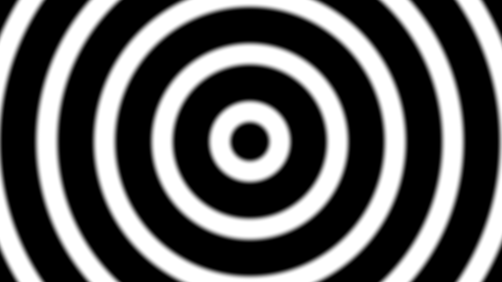
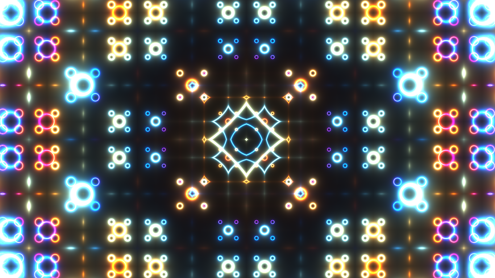
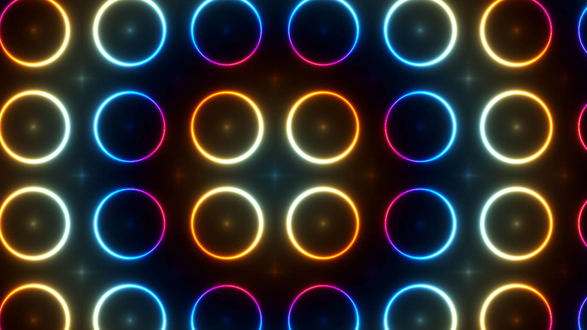

# Shader program OpenGL C++
A simple program based on gfx project. see [https://github.com/Mostafa-Khab/gfx-project.git](https://github.com/Mostafa-Khab/gfx-project.git)
This program draws a certain fragment shader.
- run `./main circle`

## take a look.

### features
you can hot-reload currently used shader after editing and saving their files using (R) key on your keyboard.
